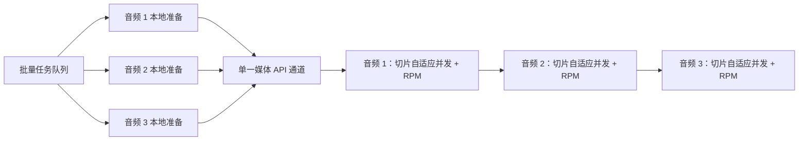

# 批量转写与并行准备

最后更新：2026-07-27（Asia/Shanghai）

## 状态

- 实现版本：`v0.12.0-rc.6`
- 实现分支：`codex/feat-batch-transcription-pipeline`
- 状态：实现、界面验收和本地安装包验证完成，等待 PR/Windows CI

## 用户流程

1. 在媒体库中选择多个媒体文件。
2. 点击“批量转写”。
3. 确认合格任务数、总时长、总大小与跳过原因。
4. 可选择是否重新加入之前失败的媒体。
5. 确认后所有合格媒体使用同一批次 ID 一次入队，并切换到转写队列。

默认规则：

- 加入未转写媒体。
- 跳过已经在活动队列中的媒体。
- 跳过已完成和部分完成的媒体。
- 失败媒体默认跳过，用户可在确认窗口中开启重试。
- 重复选择只加入一次。

## 两级调度模型

本地准备包含 FFprobe、静音检测、音轨提取和切片生成。默认并行数为 3，可在设置中调整为 1–4，或完全关闭并行准备。

API 层只允许一个媒体处于转写状态。后续媒体即使更早完成本地准备，也必须等待前面的媒体结束；某个媒体失败后，队列继续处理下一个媒体。媒体内部原有的切片级自适应并发、90–92 RPM 防线、429/503 降速、重试和有序合并逻辑保持不变。

为了限制磁盘占用，管线只提前准备“当前媒体和接下来的两个媒体”；不会一次性为整个大批次生成所有临时切片。

## 状态与取消

任务状态包括：

- 等待本地准备
- 正在准备音频
- 等待 API 转写
- 正在 API 转写
- 完成、部分完成、失败或取消

取消等待或准备中的任务不会让它进入 API 通道；取消已经准备完成的任务会立即清理其临时切片。单个媒体失败不会阻断整个批次。

## 恢复与清理

- `%APPDATA%\tingxie-mimo-asr\pending-transcriptions.json` 只保存未完成任务的轻量清单，不保存音频、Base64、转写正文或 API Key。
- 意外退出后，未完成任务在下次启动显示为“上次任务已中断”，不会自动恢复 API 调用。
- 正常退出会中止当前子进程并清理已准备的临时目录。
- 异常退出遗留超过 24 小时的 `tingxie-*` 临时目录会在下次启动时安全清理。

## 验证

- 调度器测试：3 路本地准备、1 路媒体 API、严格队列顺序。
- 动态设置测试：准备并行数从 1 调整到 3 后，等待任务立即按新策略启动。
- 取消测试：等待、准备和已准备任务都不会误入 API。
- 队列存储测试：轻量清单原子写入、读取和损坏文件安全降级。
- 临时目录测试：只清理指定根目录中超过期限的 `tingxie-*` 目录。
- 媒体库界面：混合选择时正确显示合格数量及跳过原因。
- 1080×700：批量确认窗口完整位于视口内，无页面横向溢出。
- 浏览器控制台：0 条 warning/error。
- 全量回归：43 个测试文件、154 项测试通过；TypeScript、Vite、Electron 构建及生产依赖审计通过。
- 安装包：`release/Tingxie-0.12.0-rc.6-Setup.exe`，198,719,764 B。
- SHA-256：`2AEEC47F3D8236CDAE12C0401DFA79290C1A8A0522F1424C5FFE793350042248`。
- 解包版使用隔离用户目录启动成功；FFmpeg 与 x64 FFprobe 均存在于发行资源目录。
- 当前安装包未配置商业代码签名，Windows 可能显示未知发布者。
